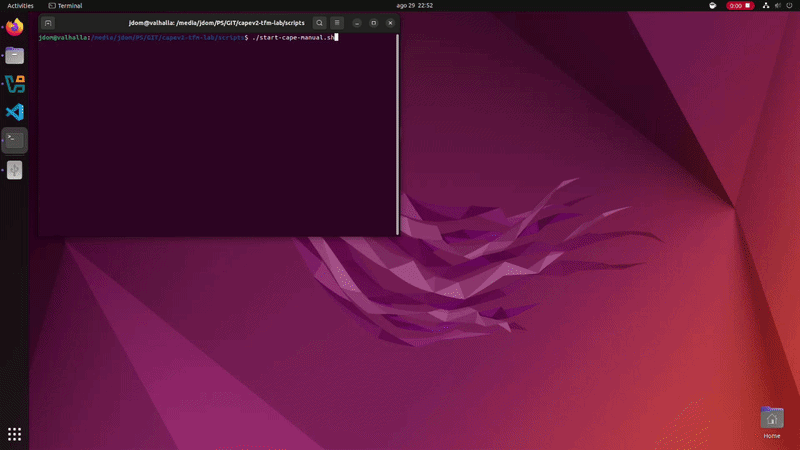

# CAPEv2 TFM Lab — Hardening de Sandbox para Análisis de Malware Evasivo

> **Trabajo Fin de Máster** · Campus Internacional de Ciberseguridad / UCAM  
> Autor: Jesús Domínguez Bueno

Este repositorio documenta de forma reproducible el despliegue, configuración y endurecimiento de un entorno de análisis dinámico basado en **CAPEv2** sobre Ubuntu Linux + VirtualBox + Windows 10 Guest.

El objetivo es que cualquier investigador o alumno pueda replicar el laboratorio desde cero, comprender las decisiones técnicas tomadas y estudiar el impacto del hardening Anti-VM sobre la extracción de IoCs.



---

## 🗂️ Estructura del repositorio

```
capev2-tfm-lab/
├── docs/
│   ├── 01-arquitectura.md          # Topología de red y componentes
│   ├── 02-setup-red-host-only.md   # Configuración de la red Host-Only en VirtualBox
│   ├── 03-setup-windows10.md       # Preparación del Guest Windows 10
│   ├── 04-instalacion-capev2.md    # Instalación de CAPEv2 en Ubuntu
│   ├── 05-configuracion-cape.md    # Ficheros de configuración clave
│   ├── 06-snapshot.md              # Creación del snapshot base
│   ├── 07-troubleshooting.md       # Errores comunes y soluciones
│   ├── 08-analisis-pafish.md       # Análisis baseline pre-hardening con PAFish
│   ├── 09-hardening.md             # Medidas de hardening Anti-VM y resultados
│   └── 10-conclusiones.md          # Conclusiones del TFM
├── config/
│   ├── virtualbox.conf.example     # Plantilla de configuración del hipervisor
│   └── cuckoo.conf.example         # Plantilla de configuración principal de CAPE
├── reports/
│   ├── baseline/
│   │   └── 1_report_pafish64_pre-hardening.json   # Reporte CAPE — estado inicial
│   └── post-hardening/
│       └── 2_report_pafish64_post-hardening.json  # Reporte CAPE — post-hardening
├── scripts/
│   ├── check-agent.sh              # Verificar que el agente del Guest responde
│   ├── start-cape-manual.sh        # Arrancar los servicios de CAPE manualmente
│   ├── hardening-host.sh           # Hardening Anti-VM en el Host via VBoxManage
│   ├── hardening-guest.ps1         # Hardening Anti-VM en el Guest Windows 10
│   └── spoof_bios.bat              # Script de startup: falsificación de SystemBiosVersion
└── samples/
    └── README.md                   # Cómo obtener PAFish (no se hostea malware aquí)
```

---

## 🏗️ Arquitectura del laboratorio

```
┌────────────────────────────────────────────────────────────────────┐
│                    HOST — Ubuntu Linux 22.04                       │
│                                                                    │
│  ┌─────────────────────┐      ┌────────────────────────────────┐   │
│  │   Orquestador CAPE  │      │   VirtualBox Hypervisor        │   │
│  │  IP: 192.168.56.1   │      │                                │   │
│  │  ResultServer: 2042 │      │  ┌──────────────────────────┐  │   │
│  │  Web UI:      8000  │◄────►│  │  Guest — Windows 10      │  │   │
│  └─────────────────────┘      │  │  IP: 192.168.56.101      │  │   │
│                               │  │  Agent: TCP 8000         │  │   │
│         vboxnet0              │  │  Snapshot: CAPE_Hardened │  │   │
│    192.168.56.0/24            │  └──────────────────────────┘  │   │
│                               └────────────────────────────────┘   │
└────────────────────────────────────────────────────────────────────┘
```

**Flujo de análisis:**
1. El usuario sube una muestra a la Web UI de CAPE (`http://localhost:8000`)
2. CAPE restaura el snapshot `CAPE_Hardened` en VirtualBox
3. El orquestador envía la muestra al agente del Guest (TCP 8000)
4. El agente inyecta el monitor de API Hooking en el proceso malicioso
5. Los logs de comportamiento se envían al ResultServer (TCP 2042)
6. Al finalizar el análisis, CAPE genera el reporte JSON con IoCs

---

## ⚡ Prerrequisitos

| Componente | Versión usada |
|---|---|
| SO Host | Ubuntu 22.04 LTS |
| Hipervisor | VirtualBox (última versión estable) |
| SO Guest | Windows 10 x64 |
| CAPEv2 | Instalado vía `cape2.sh` (rama `master`) |
| Python (Guest) | 3.10.6 (32-bit) |
| Muestra de prueba | PAFish v0.3.6 (`pafish64.exe`) |

**Hardware mínimo recomendado:**
- CPU con soporte VT-x/AMD-V habilitado en BIOS
- 8 GB RAM (4 GB para el host, 4 GB asignables al Guest)
- 80 GB de disco libre en la partición donde resida `/opt`

---

## 🚀 Guía de inicio rápido

Sigue los documentos en orden:

1. [Arquitectura y componentes](docs/01-arquitectura.md)
2. [Configurar la red Host-Only](docs/02-setup-red-host-only.md)
3. [Preparar el Guest Windows 10](docs/03-setup-windows10.md)
4. [Instalar CAPEv2 en Ubuntu](docs/04-instalacion-capev2.md)
5. [Configurar los ficheros de CAPE](docs/05-configuracion-cape.md)
6. [Crear el Snapshot base](docs/06-snapshot.md)
7. [Solución de problemas comunes](docs/07-troubleshooting.md)
8. [Análisis baseline con PAFish](docs/08-analisis-pafish.md)
9. [Hardening Anti-VM y resultados](docs/09-hardening.md)
10. [Conclusiones del TFM](docs/10-conclusiones.md)

---

## 📊 Resultados: baseline vs post-hardening

### Baseline pre-hardening (ID 1)

El análisis de `pafish64.exe` sobre el entorno sin ninguna medida de hardening (Guest Additions instaladas, sin spoofing de MAC/DMI/BIOS/disco) produjo:

| Métrica                         | Valor                                 |
|---------------------------------|---------------------------------------|
| Duración del análisis           | **238 segundos** (ejecución completa) |
| Procesos capturados             | **1**                                 |
| Malscore                        | **9.0 / 10**                          |
| Clasificación                   | **Malicious**                         |
| Firmas CAPEv2 disparadas        | **36 de 36**                          |
| Detecciones PAFish (pafish.log) | **27**                                |

**Vectores de detección Anti-VM activos:**

| Vector | Firma CAPE |
|---|---|
| 17 artefactos de Guest Additions + ventana `VBoxTrayToolWndClass` | `antivm_vbox_files`, `antivm_vbox_window`, `antivm_vbox_provname` |
| Consultas WMI a `Win32_BIOS` / `Win32_ComputerSystem` | `antivm_wmi` |
| Cadena `VBOX HARDDISK` vía SCSI + acceso directo al disco | `antivm_generic_disk`, `antivm_generic_scsi`, `physical_drive_access` |
| Prefijo MAC `08:00:27` (OUI de Oracle/VirtualBox) | `antivm_network_adapters` |
| Clave `SystemBiosDate` sin falsificar en `HKLM\HARDWARE\DESCRIPTION\System` | `recon_fingerprint` |

El reporte completo está en [`reports/baseline/1_report_pafish64_pre-hardening.json`](reports/baseline/1_report_pafish64_pre-hardening.json).

### Post-hardening (ID 2)

Tras aplicar las medidas documentadas en [`docs/09-hardening.md`](docs/09-hardening.md):

| Métrica                                  | Baseline | Post-hardening | Variación         |
|------------------------------------------|----------|----------------|-------------------|
| Malscore                                 | 9.0      | 9.0            | Sin cambio        |
| Firmas CAPEv2 disparadas                 | 36       | 36             | Sin cambio        |
| **Detecciones PAFish (pafish.log)**      | **27**   | **9**          | **−18 (−66,7%)** |
| Detecciones VBox ficheros/drivers        | 9        | 0              | ✅ 100% eliminadas |
| Detecciones VBox registro/servicios      | 6        | 0              | ✅ 100% eliminadas |
| Detección MAC 08:00:27                   | 1        | 0              | ✅ Neutralizada   |
| Detección CPUID hipervisor               | 2        | 0              | ✅ Neutralizada   |
| Detección WMI VirtualBox                 | 1        | 1              | ⚠️ Persiste       |
| Detecciones sandbox (ratón/uptime)       | 4        | 6              | ⚠️ +2 (módulo human) |
| `stealth_timeout` (nueva firma CAPEv2)   | —        | ✅ Presente    | Indicador positivo |

> **Nota sobre las métricas:** el Malscore de CAPE mide la peligrosidad del comportamiento capturado, no si el entorno fue detectado como VM, y permanece estable en 9.0. Las firmas del array `signatures[]` de CAPEv2 son 36 en ambos análisis porque CAPEv2 registra el *intento* de cada comprobación Anti-VM. La métrica relevante es `pafish.log`: registra qué artefactos encontró PAFish realmente (27 → 9, reducción del 66,7%). La firma `stealth_timeout` en POST indica que PAFish ejecutó más rutinas antes de terminar, confirmando que el hardening funcionó.

El reporte completo está en [`reports/post-hardening/2_report_pafish64_post-hardening.json`](reports/post-hardening/2_report_pafish64_post-hardening.json).

---

## 📄 Publicación

Este repositorio complementa el TFM:

> *"Mejora del Análisis de Malware Mediante el Endurecimiento de Entornos de Análisis Dinámico (CAPEv2)"*  
> Jesús Domínguez Bueno — Campus Internacional de Ciberseguridad / UCAM

---

## ⚠️ Aviso

Este laboratorio está diseñado exclusivamente para investigación académica y formación en ciberseguridad en entornos controlados y aislados. No se hostean muestras de malware real en este repositorio.
