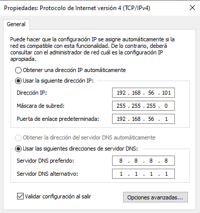

# 02 — Configurar la Red Host-Only en VirtualBox

La red Host-Only (`vboxnet0`) es el canal de comunicación exclusivo entre el Host Ubuntu y el Guest Windows 10. Sin ella, CAPE no puede enviar muestras al agente ni recibir los resultados del análisis.

---

## Paso 1: Crear la interfaz de red en VirtualBox

1. Abre VirtualBox en tu Ubuntu.
2. En el menú superior: **Archivo → Herramientas → Administrador de red** (o `Ctrl + H`).
3. En la pestaña **Redes de solo-anfitrión**, haz clic en el botón **Crear** (icono `+`).
4. Se creará una interfaz llamada `vboxnet0`.
5. Selecciónala y configúrala así:

   | Parámetro | Valor |
   |---|---|
   | Dirección IPv4 | `192.168.56.1` |
   | Máscara de red IPv4 | `255.255.255.0` |

6. Ve a la pestaña **Servidor DHCP** y **desactívalo** (desmarcar la casilla). Usaremos IPs estáticas para que CAPE siempre sepa dónde está el Guest.
7. Haz clic en **Aplicar**.

> **¿Por qué desactivar el DHCP?** CAPEv2 necesita que la IP del Guest sea fija y esté definida en `virtualbox.conf`. Si el Guest obtuviera una IP dinámica, CAPE no podría localizarlo después de restaurar el snapshot.

---

## Paso 2: Asignar el adaptador de red a la VM de Windows 10

1. Selecciona tu VM de Windows 10 en VirtualBox y ve a **Configuración → Red**.
2. En el **Adaptador 1**, asegúrate de que **"Habilitar adaptador de red"** esté marcado.
3. En **Conectado a**, selecciona **Adaptador de solo anfitrión**.
4. En **Nombre**, selecciona `vboxnet0`.
5. (Recomendado) Despliega **Avanzadas** y en **Modo promiscuo** selecciona **Permitir todo**. Esto permite que CAPE capture todo el tráfico del Guest en PCAP, incluyendo el de otros procesos que el malware pueda lanzar.
6. Haz clic en **Aceptar**.

---

## Paso 3: Configurar IP estática en Windows 10

Con la VM arrancada:

1. Pulsa `Windows + R`, escribe `ncpa.cpl` y presiona Enter (abre las Conexiones de red).
2. Clic derecho en el adaptador **Ethernet** → **Propiedades**.
3. Doble clic en **Protocolo de Internet versión 4 (TCP/IPv4)**.
4. Selecciona **Usar la siguiente dirección IP** y rellena:

   | Campo | Valor |
   |---|---|
   | Dirección IP | `192.168.56.101` |
   | Máscara de subred | `255.255.255.0` |
   | Puerta de enlace predeterminada | `192.168.56.1` |

5. En **Servidor DNS preferido**: `8.8.8.8` (Google)  
   En **Servidor DNS alternativo**: `1.1.1.1` (Cloudflare)
6. Haz clic en **Aceptar** en ambas ventanas.



---

## Paso 4: Verificar la conectividad (ping)

Por defecto el Firewall de Windows bloquea los pings. Para hacer la prueba:

**En Windows 10:**
1. Busca "Firewall de Windows Defender" en el menú Inicio.
2. Haz clic en **Activar o desactivar Firewall de Windows Defender**.
3. Desactívalo temporalmente para **ambas redes** (Privada y Pública).

> El Firewall se desactivará permanentemente en el siguiente documento como parte de la preparación del Guest para el análisis.

**En Ubuntu (terminal):**
```bash
ping 192.168.56.101
```

Deberías ver respuestas como:
```
64 bytes from 192.168.56.101: icmp_seq=1 ttl=128 time=0.456 ms
64 bytes from 192.168.56.101: icmp_seq=2 ttl=128 time=0.389 ms
```

Pulsa `Ctrl + C` para detener. Si hay respuesta, la red está correctamente configurada.

---

## Verificar la interfaz desde Ubuntu

```bash
ip addr show vboxnet0
```

Deberías ver algo similar a:
```
vboxnet0: <BROADCAST,MULTICAST,UP,LOWER_UP> mtu 1500 ...
    inet 192.168.56.1/24 brd 192.168.56.255 scope global vboxnet0
```

---

Continúa con: [03 — Preparar el Guest Windows 10 →](03-setup-windows10.md)
