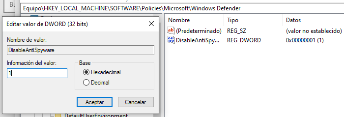
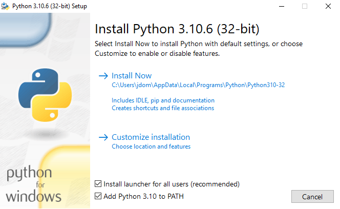
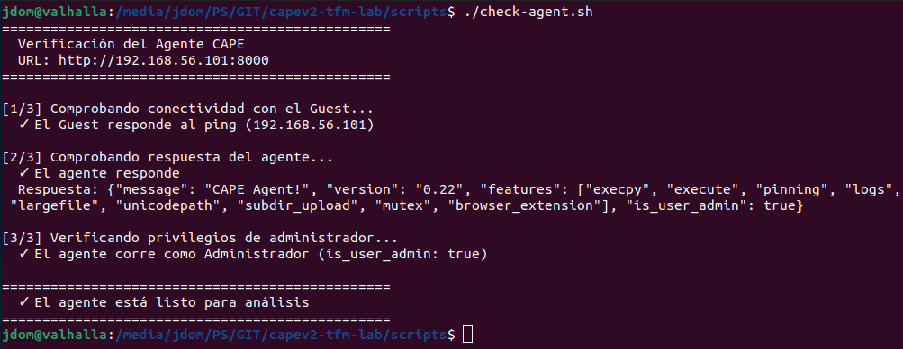

# 03 — Preparar el Guest Windows 10

La configuración del Guest tiene como objetivo crear un sistema **aparentemente normal** pero instrumentalizado al máximo para el análisis: sin defensas que bloqueen el malware, con el agente ejecutándose como Administrador y con las huellas de virtualización minimizadas.

---

## Fase 1: Pasar los ficheros al Guest (servidor HTTP temporal)

No usamos carpetas compartidas de VirtualBox intencionalmente: un malware sofisticado puede detectarlas como artefacto de virtualización. El método del servidor HTTP es más neutro.

**En Ubuntu:**

```bash
# Crear carpeta temporal y descargar los archivos necesarios
mkdir ~/compartida_vm && cd ~/compartida_vm

# Python 3.8 de 32 bits (más estable como agente en Windows)
wget https://www.python.org/ftp/python/3.10.6/python-3.10.6.exe

# Agente de CAPE (servidor HTTP ligero que escucha en el Guest)
wget https://raw.githubusercontent.com/kevoreilly/CAPEv2/master/agent/agent.py

# Levantar servidor web temporal en el puerto 8080
python3 -m http.server 8080
```

**En Windows 10** (con el Guest arrancado):

1. Abre el navegador Edge.
2. Ve a `http://192.168.56.1:8080`.
3. Descarga ambos archivos al Escritorio.
4. Vuelve a Ubuntu y pulsa `Ctrl + C` para detener el servidor.

---

## Fase 2: Desactivar Windows Defender permanentemente

El malware se negará a ejecutar su payload si detecta actividad antivirus. Windows 10 es muy agresivo reactivándolo, por lo que hay que hacerlo en dos capas:

### Capa 1 — Desde la interfaz gráfica

1. Menú Inicio → **Seguridad de Windows** → **Protección antivirus y contra amenazas**.
2. Haz clic en **Administrar la configuración**.
3. Desactiva **todo**:
   - Protección en tiempo real
   - Protección basada en la nube
   - Envío automático de muestras
   - **Protección contra alteraciones (Tamper Protection)** ← imprescindible; sin esto, Windows lo reactiva automáticamente

### Capa 2 — Desde el Registro (permanente)

1. Pulsa `Windows + R`, escribe `regedit`, pulsa Enter.
2. Navega hasta:
   ```
   HKEY_LOCAL_MACHINE\SOFTWARE\Policies\Microsoft\Windows Defender
   ```
3. Clic derecho en el panel derecho → **Nuevo → Valor de DWORD (32 bits)**.
4. Nómbralo exactamente `DisableAntiSpyware`.
5. Doble clic sobre él → establece el valor a `1`.



> **¿Por qué el Registro?** La clave de Registro aplica la política a nivel de sistema, lo que impide que la interfaz gráfica o las actualizaciones automáticas reactiven el Defender.

---

## Fase 3: Desactivar el UAC completamente

El Agente de CAPE necesita privilegios de Administrador para inyectar la DLL de monitorización en el proceso del malware. Si el UAC está activo, puede bloquear esta operación.

**Abre el Símbolo del sistema como Administrador** (clic derecho en el menú Inicio → "Terminal (Administrador)") y ejecuta:

```cmd
reg add "HKLM\SOFTWARE\Microsoft\Windows\CurrentVersion\Policies\System" /v EnableLUA /t REG_DWORD /d 0 /f
```

Deberías ver: `La operación se completó correctamente.`

**Reinicia la VM.** El cambio en el Registro no se aplica hasta el reinicio.

> **Nota de seguridad:** Esto convierte el Guest en un sistema extremadamente vulnerable. El snapshot que se toma después garantiza que este sea el estado base: cada análisis parte de aquí pero la VM nunca se expone a redes externas.

---

## Fase 4: Instalar Python y desplegar el Agente

1. Ejecuta `python-3.10.6.exe` desde el Escritorio.
2. En la primera pantalla, **marca la casilla "Add Python 3.10 to PATH"** antes de continuar.
3. Haz clic en **Install Now**.



Una vez instalado:

4. Renombra `agent.py` a `agent.pyw` (la extensión `.pyw` hace que el script se ejecute sin mostrar una ventana de terminal, reduciendo los artefactos visibles).
5. Pulsa `Windows + R`, escribe `shell:startup` y pulsa Enter. Esto abre la carpeta de inicio automático de Windows.
6. **Mueve `agent.pyw` a esa carpeta.**
7. Reinicia la VM.

Al arrancar, el agente se iniciará automáticamente en segundo plano y quedará a la espera de órdenes de CAPE.

---

## Fase 5: Verificar que el Agente funciona correctamente

Desde Ubuntu, comprueba que el agente responde:

```bash
curl http://192.168.56.101:8000
```

**Respuesta esperada (Script check-agent.sh):**



> **`is_user_admin: false` → problema.** Si ves `false`, el agente no tiene privilegios de Administrador. Ve a [07 — Troubleshooting](07-troubleshooting.md#is_user_admin-false) para solucionarlo.

El campo `is_user_admin: true` confirma que el agente tiene los permisos necesarios para la inyección de API Hooking.

---

Continúa con: [04 — Instalar CAPEv2 en Ubuntu →](04-instalacion-capev2.md)
