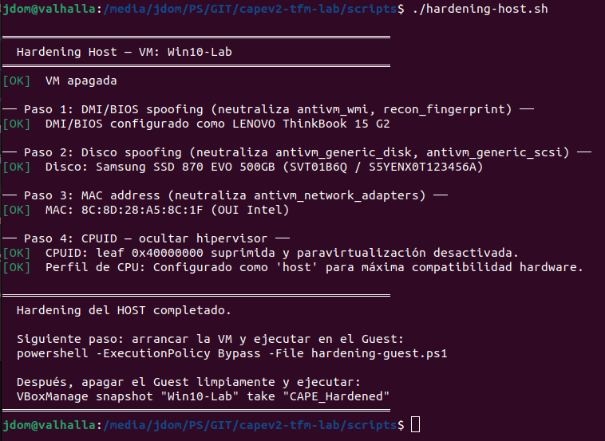
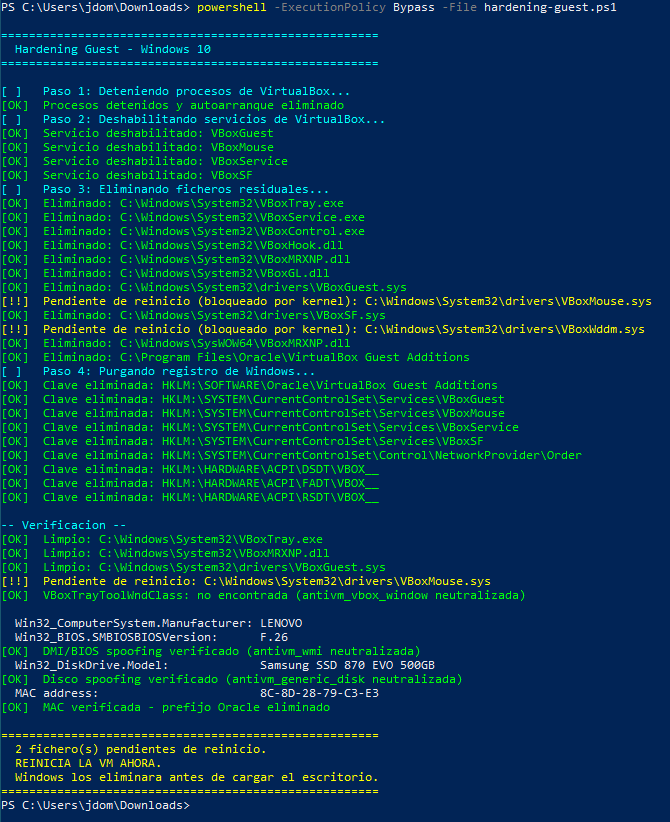
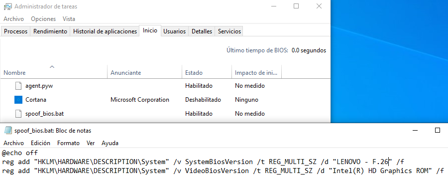

# 09 — Hardening Anti-VM: Implementacion y Resultados

> Este documento parte de los resultados del analisis baseline (doc `08`) y recoge las medidas de hardening aplicadas sobre el entorno VirtualBox + Windows 10, junto con los resultados del analisis post-hardening con PAFish. Se realizo un unico ciclo completo de hardening para concentrar el esfuerzo en el tiempo disponible.

---

## Vectores de deteccion identificados en el baseline

El analisis baseline (ID 1) revelo que PAFish ejecuto con plena visibilidad por parte de CAPE (238 s, Malscore 9.0, 36/36 firmas CAPEv2, **27 detecciones en `pafish.log`**). El objetivo del hardening no es que CAPE vea mas comportamiento — es que **PAFish no pueda identificar el entorno como una sandbox** y, por tanto, no active sus rutinas de evasion.

> **Distincion clave:** las firmas del array `signatures[]` de CAPEv2 registran el *intento* de cada comprobacion Anti-VM. La fuente de verdad es `pafish.log`: registra que artefactos encontro PAFish realmente. El hardening se mide por la reduccion de detecciones en `pafish.log`.

Los vectores prioritarios, en orden de impacto sobre el numero de firmas:

| Prioridad | Vector                          | Firmas baseline asociadas                                    |
|-----------|---------------------------------|--------------------------------------------------------------|
| 1 (critico) | VirtualBox Guest Additions    | `antivm_vbox_files` (17 artefactos), `antivm_vbox_window`, `antivm_vbox_provname` |
| 2 (alto)  | DMI/BIOS emulado                | `antivm_wmi`, `recon_fingerprint`                            |
| 3 (alto)  | Identificadores de disco        | `antivm_generic_disk`, `antivm_generic_scsi`, `physical_drive_access` |
| 4 (medio) | Direccion MAC Oracle            | `antivm_network_adapters`                                    |
| 5 (medio) | Claves de registro residuales   | `recon_fingerprint`                                          |

---

## Medidas de hardening aplicadas

El hardening se aplico en dos planos: el Host Ubuntu via `VBoxManage` (con la VM apagada) y el Guest Windows 10 via PowerShell como Administrador. Los scripts completos se encuentran en `scripts/hardening-host.sh` y `scripts/hardening-guest.ps1`.

### Plano Host (VBoxManage)

**Paso 1 — DMI/BIOS spoofing**
Neutraliza la emulacion de hardware que VirtualBox expone via tablas SMBIOS/DMI, leidas por WMI (`Win32_BIOS`, `Win32_ComputerSystem`) y por acceso directo al registro (`HKLM\HARDWARE\DESCRIPTION\System`).

```bash
VBoxManage setextradata "Win10-Lab" "VBoxInternal/Devices/pcbios/0/Config/DmiSystemVendor"    "LENOVO"
VBoxManage setextradata "Win10-Lab" "VBoxInternal/Devices/pcbios/0/Config/DmiSystemProduct"   "20SL001DGE"
VBoxManage setextradata "Win10-Lab" "VBoxInternal/Devices/pcbios/0/Config/DmiSystemVersion"   "ThinkBook 15 G2 ITL"
VBoxManage setextradata "Win10-Lab" "VBoxInternal/Devices/pcbios/0/Config/DmiBIOSVendor"      "American Megatrends Inc."
VBoxManage setextradata "Win10-Lab" "VBoxInternal/Devices/pcbios/0/Config/DmiBIOSVersion"     "F.26"
VBoxManage setextradata "Win10-Lab" "VBoxInternal/Devices/pcbios/0/Config/DmiBIOSReleaseDate" "04/15/2022"
VBoxManage setextradata "Win10-Lab" "VBoxInternal/Devices/pcbios/0/Config/DmiChassisVendor"   "LENOVO"
VBoxManage setextradata "Win10-Lab" "VBoxInternal/Devices/pcbios/0/Config/DmiBoardVendor"     "LENOVO"
VBoxManage setextradata "Win10-Lab" "VBoxInternal/Devices/pcbios/0/Config/DmiBoardProduct"    "LNVNB161216"
```

**Paso 2 — Disco spoofing**
Reemplaza el string `VBOX HARDDISK` en el firmware ATA/SCSI emulado, visible via IOCTL y via `Win32_DiskDrive`.

```bash
VBoxManage setextradata "Win10-Lab" "VBoxInternal/Devices/ahci/0/Config/Port0/ModelNumber"      "Samsung SSD 870 EVO 500GB"
VBoxManage setextradata "Win10-Lab" "VBoxInternal/Devices/ahci/0/Config/Port0/FirmwareRevision" "SVT01B6Q"
VBoxManage setextradata "Win10-Lab" "VBoxInternal/Devices/ahci/0/Config/Port0/SerialNumber"     "S5YENX0T123456A"
```

**Paso 3 — MAC address**
Sustituye el prefijo Oracle (`08:00:27`) por un OUI de Intel, eliminando la deteccion via `GetAdaptersInfo`.

```bash
VBoxManage modifyvm "Win10-Lab" --macaddress1 "8C8D28$(openssl rand -hex 3 | tr a-z A-Z)"
```

**Paso 4 — CPUID**
Suprime la hoja de firma del hipervisor (`EAX=0x40000000`, que devuelve `VBoxVBoxVBox`) y desactiva la paravirtualizacion.

```bash
VBoxManage setextradata "Win10-Lab" "VBoxInternal/CPUM/SuppressHypervisorCpuIdLeaf" 1
VBoxManage modifyvm "Win10-Lab" --paravirtprovider none
VBoxManage modifyvm "Win10-Lab" --cpu-profile "host"
```



### Plano Guest (PowerShell + spoof_bios.bat)

**Paso 1 — Desinstalacion de Guest Additions**
Via `Win32_Product.Uninstall()`. Elimina simultaneamente los 17 artefactos de `antivm_vbox_files`, el proceso `VBoxTray.exe` responsable de `antivm_vbox_window`, y la DLL `VBoxMRXNP.dll` responsable de `antivm_vbox_provname`.

**Paso 2 — Limpieza de ficheros residuales**
Eliminacion de drivers, DLLs y ejecutables restantes en `System32`, `SysWOW64` y `drivers\`. `VBoxWddm.sys` no pudo eliminarse en ningun ciclo de reinicio — el kernel lo retiene de forma persistente, lo que constituye una limitacion real del entorno documentada en la seccion de limitaciones.

**Paso 3 — Eliminacion de servicios y registro**
Deshabilitacion (`Start=4`) y borrado de los servicios `VBoxGuest`, `VBoxMouse`, `VBoxService`, `VBoxSF`, `VBoxVideo`, `VBoxNetAdp`, `VBoxNetLwf`. Limpieza de claves ACPI (`DSDT\VBOX__`, `FADT\VBOX__`, `RSDT\VBOX__`) y eliminacion de la entrada `VBoxSF` de `NetworkProvider\Order`.



**spoof_bios.bat (startup)**
Script de autoarranque que falsifica `SystemBiosVersion` en `HKLM\HARDWARE\DESCRIPTION\System`, complementando el spoofing DMI/BIOS del hipervisor con valores coherentes con el perfil LENOVO configurado en el host:

```bat
@echo off
reg add "HKLM\HARDWARE\DESCRIPTION\System" /v SystemBiosVersion /t REG_MULTI_SZ /d "LENOVO - F.26" /f
reg add "HKLM\HARDWARE\DESCRIPTION\System" /v VideoBiosVersion /t REG_MULTI_SZ /d "Intel(R) UHD Graphics Controller" /f
```



**Simulacion de actividad humana (CAPE auxiliary.conf)**

```ini
[human]
enabled = yes
```

Habilita el modulo de simulacion de movimiento de raton e interaccion con ventanas durante el analisis, mitigando detecciones basadas en ausencia de actividad de usuario.

---

## Resultados del analisis post-hardening

El reporte completo esta en [`reports/post-hardening/2_report_pafish64_post-hardening.json`](../reports/post-hardening/2_report_pafish64_post-hardening.json).

### Metadatos del analisis

| Campo               | Valor                  |
|---------------------|------------------------|
| ID de analisis      | 2                      |
| Maquina             | Win10-Lab (VirtualBox) |
| Snapshot            | CAPE_Hardened          |

### Metadatos de la muestra

Identica al baseline: `pafish64.exe`, MD5 `4b6229d1b32d7346cf4c8312a8bc7925`.

### Resultados de extraccion

| Metrica               | Baseline (ID 1) | Post-hardening (ID 2) | Variacion      |
|-----------------------|-----------------|----------------------|----------------|
| **Malscore**          | 9.0 / 10        | 9.0 / 10             | Sin cambio     |
| **Malstatus**         | Malicious       | Malicious            | Sin cambio     |
| **Procesos capturados** | 1             | 1                    | Sin cambio     |

> **Nota sobre el Malscore y la metrica correcta:** el Malscore de CAPE no mide si el entorno es detectado como VM — mide la peligrosidad del comportamiento capturado, y permanece estable en 9.0. Las firmas del array `signatures[]` son 36 en ambos analisis porque CAPEv2 registra el intento de cada comprobacion independientemente del resultado. La metrica relevante es **`pafish.log`**: 27 detecciones en PRE → 9 en POST (reduccion del 66,7%). La firma `stealth_timeout` en POST confirma que PAFish termino antes de completar todas sus rutinas, lo que indica que el entorno ya no era tan obviamente detectable.

---

## Comparativa de firmas: baseline vs post-hardening

### Detecciones neutralizadas (fuente: pafish.log)

Detecciones presentes en `pafish.log` del baseline que **no aparecen** en el `pafish.log` post-hardening. Nota: estas detecciones siguen apareciendo en el array `signatures[]` de CAPEv2 porque ese campo registra el intento de la comprobacion, no si PAFish encontro el artefacto.

| Deteccion PAFish                              | Categoria          | Medida que la neutralizo       |
|-----------------------------------------------|--------------------|--------------------------------|
| CPUID hypervisor vendor `VBoxVBoxVBox`        | CPUID hipervisor   | `SuppressHypervisorCpuIdLeaf`  |
| Hypervisor bit en cpuid feature bits          | CPUID hipervisor   | `paravirtprovider none`        |
| Reg key `SOFTWARE\Oracle\VirtualBox Guest Additions` | Registro   | Desinstalacion GA              |
| Reg key `VideoBiosVersion`                    | Registro           | `spoof_bios.bat`               |
| Servicios `VBoxGuest/Mouse/Service/SF`        | Registro           | Limpieza de servicios          |
| Driver `VBoxMouse.sys`                        | Ficheros GA        | Desinstalacion GA              |
| Driver `VBoxGuest.sys`                        | Ficheros GA        | Desinstalacion GA              |
| Driver `VBoxSF.sys`                           | Ficheros GA        | Desinstalacion GA              |
| `vboxhook.dll`, `vboxmrxnp.dll`              | Ficheros GA        | Desinstalacion GA              |
| `vboxservice.exe`, `vboxtray.exe`, `VBoxControl.exe` | Ficheros GA | Desinstalacion GA              |
| Directorio `Program Files\Oracle\VirtualBox Guest Additions` | Ficheros GA | Desinstalacion GA    |
| MAC address `08:00:27` (OUI Oracle)           | Red                | MAC spoofing (host)            |
| Dispositivo `\\.\VBoxMiniRdrDN`               | Dispositivos       | Desinstalacion GA              |
| Ventana VBoxTray / network share              | Ventanas/Red       | Desinstalacion GA              |

**18 detecciones neutralizadas** de 27 → reduccion del **66,7%** en `pafish.log`.

### Firmas persistentes

Firmas presentes en ambos analisis. Se dividen en dos grupos segun su naturaleza:

**Inherentes a PAFish / inamovibles sin romper CAPE:**

| Firma                  | Motivo de persistencia                                                    |
|------------------------|---------------------------------------------------------------------------|
| `antisandbox_unhook`   | PAFish detecta los hooks WMI del agente de CAPE. Inherente a la instrumentacion; eliminarlo requeriria desactivar la monitorizacion. |
| `antivm_wmi`           | PAFish realiza consultas WMI a `Win32_ComputerSystem`/`Win32_BIOS`. La firma se dispara por el patron de llamadas, no por el valor devuelto. |
| `mouse_movement_detect`| Deteccion de movimiento de raton. La simulacion humana de CAPE no es suficiente para engañar a PAFish en esta comprobacion. |
| `recon_fingerprint`    | Lectura de `SystemBiosDate`. La clave existe aunque su valor sea correcto. |
| `amsi_enumeration`     | Enumeracion de proveedores AMSI; comportamiento de PAFish independiente del entorno. |
| `privilege_elevation_check` | Comprobacion de privilegios; inamovible.                            |

**Artefactos de Guest Additions residuales (parcialmente eliminados):**

| Firma                  | Causa                                                                     |
|------------------------|---------------------------------------------------------------------------|
| `antivm_vbox_files`    | Ficheros residuales detectados: `vboxoglpackspu.dll`, `vboxoglpassthroughspu.dll`, `vboxoglfeedbackspu.dll`, `VBoxSF.sys`, `VBoxControl.exe`, `vboxservice.exe`, `vboxtray.exe`, `VBoxGuest.sys`, `VBoxMouse.sys`, `VBoxVideo.sys`. |
| `antivm_vbox_window`   | `VBoxTrayToolWndClass` aun activa durante el analisis.                   |
| `antivm_vbox_provname` | `VBoxMRXNP.dll` o entrada de NetworkProvider aun presente.               |
| `packer_entropy`       | Alta entropia del binario; caracteristica propia de PAFish.               |
| `pe_tls_callbacks` / `antianalysis_tls_section` | Estructura del binario; independiente del entorno. |
| `enumerates_running_processes` | Comportamiento de PAFish; inamovible.                           |

### Cambios en post-hardening: stealth_timeout y nuevas detecciones pafish.log

La unica firma **genuinamente nueva** en el array `signatures[]` de CAPEv2 en post-hardening es `stealth_timeout`. Las demas firmas del array estaban presentes en ambos analisis — CAPEv2 registra el intento de la comprobacion en los dos casos.

En `pafish.log` se observan las siguientes detecciones presentes en post-hardening pero ausentes o diferentes en el baseline:

| Deteccion PAFish                                         | Interpretacion                                               |
|----------------------------------------------------------|--------------------------------------------------------------|
| `Sandbox traced by absence of mouse device` (nueva)      | El modulo `human` de CAPE no simulo el dispositivo de raton a nivel hardware |
| `CPU VM traced by rdtsc` (variante adicional)            | La supresion del leaf CPUID altero el comportamiento del contador de ciclos |
| Variante de `missing dialog confirmation`                | Comprobacion de dialogo ligeramente distinta a la del baseline |

> **`stealth_timeout` es el indicador positivo clave:** PAFish termino antes de completar todas sus rutinas porque el entorno ya no era tan obviamente detectable como en el baseline. La reduccion de 27 a 9 detecciones en `pafish.log` cuantifica el avance real del hardening.

---

## Analisis de causas: detecciones residuales en pafish.log POST

> **Aclaracion importante:** Las firmas `antivm_vbox_files`, `antivm_vbox_window`, `antivm_vbox_provname`, `antivm_vbox_keys` y `antivm_generic_diskreg` siguen apareciendo en el array `signatures[]` de CAPEv2 en post-hardening porque CAPEv2 registra el *intento* de esas comprobaciones. Sin embargo, **PAFish no encontro los artefactos correspondientes**: estas detecciones **no aparecen en `pafish.log` POST**. La distincion entre "firma disparada en CAPEv2" y "deteccion confirmada en `pafish.log`" es critica para interpretar correctamente los resultados.

Las detecciones que si persisten en `pafish.log` POST tienen estas causas raiz:

### WMI — Unica deteccion Anti-VM de VirtualBox residual

La deteccion *"VirtualBox device identifiers traced using WMI"* persiste en `pafish.log` post-hardening. El spoofing DMI/BIOS modifica los valores que `Win32_BIOS` y `Win32_ComputerSystem` devuelven, pero no afecta a todos los identificadores de dispositivo que VirtualBox expone via WMI — en particular los procedentes del DSDT embebido en la imagen de la VM. Su eliminacion definitiva requeriria editar el DSDT a nivel de firmware con herramientas como `iasl`.

### Detecciones de sandbox por comportamiento (raton y uptime)

Las detecciones basadas en ausencia de actividad humana persisten y se incrementan ligeramente en POST. El modulo `human` de CAPE no fue suficiente para satisfacer todas las comprobaciones de raton de PAFish. Aparece una nueva deteccion en POST: *"Sandbox traced by absence of mouse device"*, lo que indica que el modulo simulo movimientos de raton pero no la presencia del dispositivo de hardware, lo que PAFish verifica de forma independiente.

### CPUID rdtsc timing — Inherente a la virtualizacion

La deteccion de timing por `rdtsc` es estructuralmente inherente a cualquier hipervisor. En POST aparece una variante adicional, posiblemente como efecto secundario de la supresion del leaf CPUID del hipervisor (`SuppressHypervisorCpuIdLeaf`). Solo puede resolverse mediante monitorizacion basada en hipervisor (VMI) como DRAKVUF.

---

## Tabla resumen de efectividad

| Vector de deteccion              | Detecciones pafish.log PRE | Estado POST               |
|----------------------------------|---------------------------|---------------------------|
| CPUID hipervisor                 | 2                         | **Neutralizado** (0)      |
| Ficheros/drivers Guest Additions | 9                         | **Neutralizado** (0)      |
| Claves de registro VBox/servicios| 6                         | **Neutralizado** (0)      |
| Dispositivos/ventana/red VBox    | 3                         | **Neutralizado** (0)      |
| MAC 08:00:27 (Oracle)            | 1                         | **Neutralizado** (0)      |
| Disco VBOX HARDDISK              | 3                         | **Neutralizado** (0)      |
| WMI identificadores VBox         | 1                         | **Persiste** (1)          |
| Sandbox raton/uptime             | 4                         | **Parcial** (6, +2 nuevas)|
| CPUID rdtsc timing               | 1                         | **Parcial** (2, +1 nueva) |
| Instrumentacion CAPE             | —                         | **Inamovible** (`antisandbox_unhook` en CAPEv2) |

---

## Limitaciones identificadas

1. **DLLs OpenGL de VirtualBox no incluidas en el script inicial.** Las DLLs `vboxogl*spu.dll` no formaban parte de la lista de residuales del hardening. Requieren inclusion explicita en una iteracion futura.

2. **`VBoxWddm.sys` inextirpable.** El driver de display de VirtualBox no pudo eliminarse tras multiples ciclos de reinicio. El kernel lo retiene de forma persistente incluso con `MoveFileEx MOVEFILE_DELAY_UNTIL_REBOOT`. Es una limitacion real del entorno: su eliminacion requeriria deshabilitar el driver en el Administrador de dispositivos y sustituirlo por el driver de pantalla generica de Microsoft antes de intentar el borrado.

3. **Regeneracion de tablas ACPI por el hipervisor.** Las claves `HARDWARE\ACPI\DSDT\VBOX__` son regeneradas por VirtualBox en cada arranque desde el DSDT embebido de la VM. El spoofing DMI/BIOS no las afecta directamente; su eliminacion requeriria modificar el DSDT a nivel de imagen de disco de la VM.

4. **`VBoxTrayToolWndClass` en el snapshot.** La ventana estaba activa en el momento de crear `CAPE_Hardened`, lo que indica que el proceso `VBoxTray.exe` estaba en memoria o que una entrada de autoarranque residual lo relanzaba.

5. **`antisandbox_unhook` es inherente a CAPE.** PAFish detecta y revierte activamente los hooks WMI del agente de monitorizacion. Esta firma no puede neutralizarse sin desactivar la instrumentacion de comportamiento de CAPE, lo que contradice el objetivo del entorno.

---

## Snapshot final

```bash
VBoxManage snapshot "Win10-Lab" take "CAPE_Hardened" \
    --description "Post-hardening: GA parcialmente eliminadas, DMI/BIOS/disco spoofed, MAC Intel, CPUID oculto"

# Configuracion en /opt/CAPEv2/conf/virtualbox.conf
# snapshot = CAPE_Hardened
```

---

## Referencias

- [VBoxManage extradata — Oracle VirtualBox Manual §9.9](https://www.virtualbox.org/manual/ch09.html#idm6006)
- [PAFish — Paranoid Fish (a0rtega)](https://github.com/a0rtega/pafish)
- [Al-Khaser — Anti-VM checks reference](https://github.com/LordNoteworthy/al-khaser)
- [CAPEv2 — Configuration Reference](https://github.com/kevoreilly/CAPEv2/tree/master/conf)
- [MITRE ATT&CK T1497 — Virtualization/Sandbox Evasion](https://attack.mitre.org/techniques/T1497/)

Para finalizar: [10 — Conclusiones →](10-conclusiones.md)